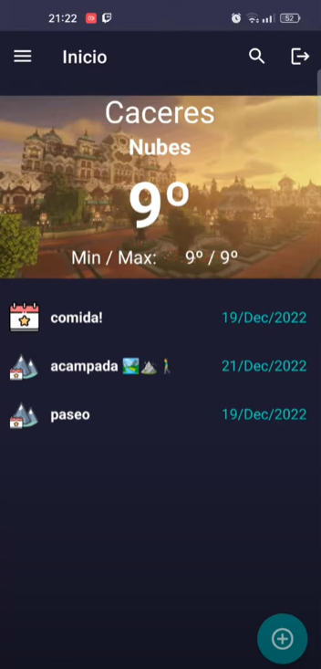

# ClimApp

ClimApp is a weather-focused Android application designed to help users track real-time weather conditions for various locations across Spain, leveraging data from the AEMET (Spanish Meteorological Agency) Open Data API. The app provides users with the ability to not only check the weather but also create, manage, and monitor events that are affected by weather conditions, such as outdoor activities, events, and trips.

The core idea of ClimApp is to enhance the user's interaction with weather data by allowing them to tie weather forecasts to personalized events in specific locations, including both cities and mountainous areas. The app's user-friendly interface ensures that both casual users and those who need more advanced weather-related features can easily access the information they need.

## Key Features

- **Real-time Weather Updates**: The app displays live weather conditions based on the device's current location or a user-specified location, providing detailed forecasts on temperature, precipitation, wind, and more.
  
- **Event Management System**: Users can create events and associate them with specific locations. Events are linked to real-time weather forecasts, allowing users to plan their activities around current or predicted weather conditions. Events can be fully managed, including options to add, edit, and delete events.

- **Municipality and Mountain Support**: ClimApp supports the creation of events in both urban areas (municipalities) and rural/mountainous regions. This is particularly useful for users who enjoy outdoor activities such as hiking, camping, or outdoor events in these environments.

- **Personalized User Settings**: Users can customize their app experience by modifying their preferences, such as changing the app’s language (English or Spanish), switching between light and dark themes, and managing user account details.

- **Weather Forecast Details**: Users can easily view detailed weather forecasts for any location in Spain. The app provides a breakdown of the current conditions, forecasts for the upcoming hours and days, and alerts for any significant weather changes.

- **User Profile Management**: ClimApp requires users to create an account to manage their events. Once registered, users can update their personal details, review their event history, and even delete their account if necessary.

- **Localization and Multilingual Support**: The app is available in both English and Spanish, making it accessible to a wide range of users.

## Technology Stack

- **Development Platform**: The app is developed using Android Studio, leveraging its comprehensive toolkit for building, testing, and deploying Android applications.
  
- **API Integration**: The AEMET Open Data API provides weather data for the app, ensuring accurate and up-to-date forecasts for all locations across Spain.

- **Architecture**: ClimApp follows the Model-View-ViewModel (MVVM) architecture pattern, which enhances scalability, modularity, and maintainability. This approach ensures a clear separation between the user interface and the business logic, making the app easier to maintain and extend.

- **Database**: Local storage is used to manage event data, allowing users to store and retrieve their personalized events even when offline.

- **Testing & Continuous Integration**: The app is thoroughly tested for both functionality and performance. Continuous integration tools, such as Jira and SonarCloud, are used to track issues and maintain code quality.

## Target Audience

ClimApp is tailored for individuals between the ages of 18 and 50 who regularly participate in outdoor activities, events, or need reliable weather data for planning purposes. The app is especially useful for people who engage in outdoor sports, organize events such as weddings or picnics, or need to stay informed about weather conditions in remote or mountainous areas.

The app is designed with simplicity and functionality in mind, providing a seamless experience for both casual users looking for basic weather information and more advanced users who need detailed forecasts and event-specific weather tracking.

## Future Enhancements

The development team plans to expand the functionality of ClimApp by introducing features such as:
- **Push Notifications**: Alerts for severe weather conditions or updates on weather changes for specific events.
- **Social Sharing**: Allow users to share weather reports and event details with friends and family.
- **Expanded Location Support**: Include more regions beyond Spain, allowing for broader weather tracking.

## Interface

